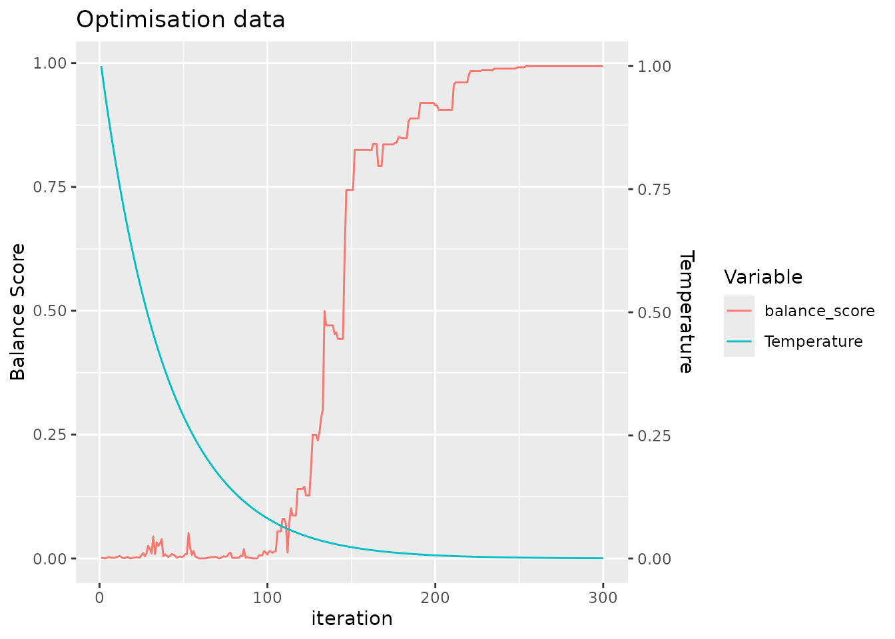
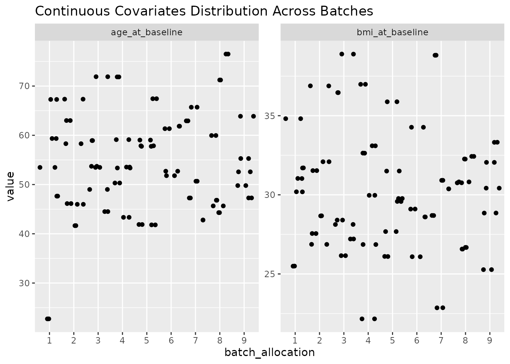

# Methods for Allocating Samples to Batches

## Introduction

Especially as the costs of performing assays has decreased, there has
been a move from analysing few samples from carefully controlled
experiments to analysing many samples directly from patient population
of interest. Controlled experiments are performed in experimental model
systems in order that covariates can be held constant across all
experimental units, whereas in clinical samples there will commonly be
number of covariates that also impact upon the dependent variable of
interest. Performing assays on a large number of samples requires that
the be analysed in *batches*, which results in technical variation that
should be accounted for in the analysis.

Here we demonstrate a tool to allocate pre-selected samples into these
technical batches in a way that maximises the balance of specified
covariates. By maximising the balance we maximise our ability to
separate technical batch variation from biological effects of interest.
This increases the precision of our estimates by reducing the
uncertainty in coefficient estimates for our primary predictors
variables, and hence gives greater statistical power to detect true
effects.

## Generate some simulated data with covarirates

First, we generate some simulated data with covariates. We will generate
98 samples with 3 covariates, and then allocate these samples to batches
of 13.

``` r
toy_data = simulate_data(n_samples = 98, block_size = 2)

head(toy_data)
#>   sample_id age_at_baseline bmi_at_baseline sex sample_timepoint treatment
#> 1  sample_1        65.70611        22.86157   M      timepoint_1 treatment
#> 2  sample_2        65.70611        22.86157   M      timepoint_2 treatment
#> 3  sample_3        53.54606        33.09642   M      timepoint_1 treatment
#> 4  sample_4        53.54606        33.09642   M      timepoint_2 treatment
#> 5  sample_5        43.34455        29.96901   F      timepoint_1 treatment
#> 6  sample_6        43.34455        29.96901   F      timepoint_2 treatment
#>   subject_id
#> 1  subject_1
#> 2  subject_1
#> 3  subject_2
#> 4  subject_2
#> 5  subject_3
#> 6  subject_3
```

## Methods to allocate samples to batches

### Randomisation

A common approach reported in the analysis of clinical samples is to
simply randomise samples to different batches. Randomisation is
frequently used in clinical trials to try to ensure that the treatment
groups are balanced with respect to relevant covariates. In this
circumstance, covariates for all patients are not known at the time when
treatments are allocated and so randomisation our best option to ensure
that the control and treatment groups are balanced with respect to these
covariates. In statistical terms, there is no bias: the expectation of
the value of any given covariates would be equal for both a control and
a treatment group: i.e. that if we repeated the experiment many times,
the average value of the covariate would be the same for both groups.

We can simply generate a random layout of our toy dataset of 98 samples
to a batch size of 13 as follows:

``` r
single_layout = allocate_samples(toy_data,
                                 batch_size = 13,
                                 covariates = c("age_at_baseline", "bmi_at_baseline", "sex"),
                                 method = "random",
                                 blocking_variable = NA)
#> No blocking variable specified. 
#> Covariate: age_at_baseline - continuous
#> Covariate: bmi_at_baseline - continuous
#> Covariate: sex - categorical
#> Number of samples: 98
#> Joining with `by = join_by(age_at_baseline, bmi_at_baseline, sex,
#> sample_id)`

head(single_layout$layout)
#>   age_at_baseline bmi_at_baseline sex sample_id batch_allocation
#> 1        65.70611        22.86157   M  sample_1                7
#> 2        65.70611        22.86157   M  sample_2                7
#> 3        53.54606        33.09642   M  sample_3                3
#> 4        53.54606        33.09642   M  sample_4                6
#> 5        43.34455        29.96901   F  sample_5                3
#> 6        43.34455        29.96901   F  sample_6                2
#>   sample_timepoint treatment subject_id
#> 1      timepoint_1 treatment  subject_1
#> 2      timepoint_2 treatment  subject_1
#> 3      timepoint_1 treatment  subject_2
#> 4      timepoint_2 treatment  subject_2
#> 5      timepoint_1 treatment  subject_3
#> 6      timepoint_2 treatment  subject_3
```

The function `allocate_samples` returns a list with the layout of
samples to batches in the `layout` slot and the probability that a
covaraite does not differ between the batches (appropriate for
continuous or categorical variables depending upon the input data type)
in the `results` slot. With a given set of samples, the sample size is
fixed and thus calculating a *p*-value for the difference in the
covariate between the batches is directly related to the underlying test
statistic. The `results` slot contains the *p*-value for the difference
in each covariate between the batches.

We can assess the balance of the layout across all of our specified
covariates by calculating a balance score (defined in the following
sections). This metric is in the range \[0, 1\], with higher values
indicating better balance.

``` r
calculate_balance_score(single_layout[['results']]$p_value)
#> [1] 0.5169404
```

Here we can see that the balance score of our layout is low (indicative
of imbalance), despite the fact that the layout was generated randomly.
This is because whilst randomisation ensures no statistical bias, it
does not remove the impact of chance, in that there is still *variance*
in the balance of the covariates between the batches.

In order to demonstrate this empirically, we can generate a large number
of random layouts and examine the distribution of the balance score. As
can be seen in the documentation, the
[`allocate_samples()`](https://john-mulvey.github.io/SampleAllocateR/reference/allocate_samples.md)
function includes a random seed for reproducibility, and so here we
explicitly set a series of different random seeds.

``` r
set.seed(123)
random_seeds <- sample(1:10000, 1000, replace = FALSE)

results_list <- lapply(random_seeds, function(seed) {
  allocate_samples(toy_data,
                   batch_size = 13,
                   covariates = c("age_at_baseline", "bmi_at_baseline", "sex"),
                   method = "random",
                   blocking_variable = NA,
                   seed = seed)
})

# plot histrogram for a single covariate: age_at_baseline
probability_age_at_baseline <- lapply(seq_along(results_list), function(i) {
  data.frame(
    iteration_number = i,
    p_value = results_list[[i]][['results']] %>%
      filter(covariate == "age_at_baseline") %>%
      pull(p_value)
  )
})
plot_data_age_at_baseline <- do.call(rbind, probability_age_at_baseline)
```

``` r
# plot histrogram of probability that age_at_baseline does not differ between the batches
plot_data_age_at_baseline %>%
  ggplot(aes(x = p_value)) +
  geom_histogram(binwidth = 0.05, boundary = 0)
```


As expected given the lack of bias that randomisation guarantees, over
many iterations we observe a uniform distribution of the *p*-value
calcualted for a single variable. But note that within this set of
random layouts, there are still many layouts with a low *p*-value:
indicating that the covariate is not balanced between the batches
despite randomisation.

In order to simultaneously assess the balance of multiple covariates
between batches, we combine the *p*-values for all covariates which are
each calculated by the appropriate statistical test. For this we used
the established approach of calculating the harmonic mean of the
*p*-values, which has the advantage over alternative options in that it
does not require the restrictive assumption that covariates are
independent. The distribution of the balance score across these many
random layouts shows that there are few layouts with high score that
indicate they are well balanced across all covariates.

``` r
balance_score <- lapply(seq_along(results_list), function(i) {
  data.frame(
    iteration_number = i,
    balance_score = calculate_balance_score(results_list[[i]][['results']]$p_value)
  )
})

plot_data_balance_score <- do.call(rbind, balance_score)

# plot histrogram of balance scores
plot_data_balance_score  %>%
  ggplot(aes(x = balance_score)) +
  geom_histogram(binwidth = 0.05, boundary = 0) +
  xlim(c(0, 1))
```


The “brute force” approach of allocating samples to batches would simply
then select the best layout from these random layouts. This is
implemented in the `allocate_samples` function using the
`method = "best_random"` argument for demonstration purposes (though
note that due to the use of different random seeds, this layout may
differ from that we have generated above). Here, we generate 1000 random
layouts and then select the one with the best balance of the covariates.

``` r
best_random_layout = allocate_samples(toy_data, 
                                 batch_size = 13, 
                                 covariates = c("age_at_baseline", "bmi_at_baseline", "sex"),
                                 iterations = 1000,
                                 method = "best_random")
#> No blocking variable specified. 
#> Covariate: age_at_baseline - continuous
#> Covariate: bmi_at_baseline - continuous
#> Covariate: sex - categorical
#> Number of samples: 98 
#> Balance Score: 0.9100344
#> Joining with `by = join_by(age_at_baseline, bmi_at_baseline, sex,
#> sample_id)`

head(best_random_layout$layout)
#>   age_at_baseline bmi_at_baseline sex sample_id batch_allocation
#> 1        65.70611        22.86157   M  sample_1                2
#> 2        65.70611        22.86157   M  sample_2                6
#> 3        53.54606        33.09642   M  sample_3                2
#> 4        53.54606        33.09642   M  sample_4                5
#> 5        43.34455        29.96901   F  sample_5                6
#> 6        43.34455        29.96901   F  sample_6                1
#>   sample_timepoint treatment subject_id
#> 1      timepoint_1 treatment  subject_1
#> 2      timepoint_2 treatment  subject_1
#> 3      timepoint_1 treatment  subject_2
#> 4      timepoint_2 treatment  subject_2
#> 5      timepoint_1 treatment  subject_3
#> 6      timepoint_2 treatment  subject_3
```

We can see that the best random layout is clearly a superior layout to
the common practice of performing a single randomisation as we did
above. On the other side of the coin, there are still many possible
layouts that have superior balance.

``` r
calculate_balance_score(best_random_layout[['results']]$p_value)
#> [1] 0.9100344
```

### Optimisation methods from machine learning

Even with the processing capabilities of modern desktop computers, brute
force approaches such as applied above are problematic since the number
of possible combinations quickly explodes. Since exhaustive search is
therefore impractical, we exploit machine learning optimisation
approaches in order to maximise the balance of the batches that are
generated. Specifically we utilise a simulated annealing algorithm,
which is a heuristic optimisation method that can efficiently
approximate the global optimum of a large search space. Interested
readers are directed towards the general introduction from wikipedia
\[wikipedia_2023a\]. Practically, we implement the method here as the
default method using to allocate samples to different batches (but can
be explicitly specified using the argument
`method = "simulated_annealing"`).

``` r
optimal_layout = allocate_samples(toy_data, 
                                 batch_size = 13, 
                                 covariates = c("age_at_baseline", "bmi_at_baseline", "sex"),
                                 iterations = 300,
                                 plot_convergence = TRUE)
#> No blocking variable specified. 
#> Covariate: age_at_baseline - continuous
#> Covariate: bmi_at_baseline - continuous
#> Covariate: sex - categorical
#> Number of samples: 98
```


    #> Balance Score of final layout: 0.9969619
    #> Joining with `by = join_by(age_at_baseline, bmi_at_baseline, sex,
    #> sample_id)`

For clarity, we return a plot to make it easy for the user to confirm
that the simulated annealing algorithm has been run with a sufficient
number of iterations to converge, seen by the saturation of the balance
score.

Accordingly, we also achieve a more balanced configuration than that of
the best random layout.

``` r
calculate_balance_score(optimal_layout[['results']]$p_value)
#> [1] 0.9971285
```

We can also compare the run time of the simulated annealing algorithm to
that of the best random layout.

``` r
# rerun best_random_layout to calculate run time
runtime_brute_force <- system.time({
  best_random_layout <- allocate_samples(toy_data, 
                                         batch_size = 13, 
                                         covariates = c("age_at_baseline", "bmi_at_baseline", "sex"),
                                         iterations = 1000,
                                         method = "best_random")
})
#> No blocking variable specified. 
#> Covariate: age_at_baseline - continuous
#> Covariate: bmi_at_baseline - continuous
#> Covariate: sex - categorical
#> Number of samples: 98 
#> Balance Score: 0.9100344
#> Joining with `by = join_by(age_at_baseline, bmi_at_baseline, sex,
#> sample_id)`

# rerun optimal_layout to calculate run time
runtime_optimal <- system.time({
  optimal_layout <- allocate_samples(toy_data, 
                                     batch_size = 13, 
                                     covariates = c("age_at_baseline", "bmi_at_baseline", "sex"),
                                     method = "simulated_annealing",
                                     iterations = 300)
})
#> No blocking variable specified. 
#> Covariate: age_at_baseline - continuous
#> Covariate: bmi_at_baseline - continuous
#> Covariate: sex - categorical
#> Number of samples: 98
```


    #> Balance Score of final layout: 0.9969619
    #> Joining with `by = join_by(age_at_baseline, bmi_at_baseline, sex,
    #> sample_id)`

    # plot run times
    data.frame(method = c("brute_force", "simulated_annealing"),
               time = c(runtime_brute_force, runtime_optimal)) %>%
      ggplot(aes(x = method, y = time, fill = method)) +
      geom_col() +
      labs(y = "Times (s)")


In addition to generating a more balanced layout, we see that the
machine learning approach also achieves this with fewer iterations and
in less run time.

## Blocking

There is a adage on the design of experiments, commonly attributed to
George Box, to “block what you can, randomise what you cannot”. We have
discussed the limitations of randomisation in situations where the
covariates for all samples are already known in advance. However, the
advice to block variables is still pertinent in our situation, as
blocking will completely remove the impact of the technical batch effect
upon a blocked predictor variable rather than only mitigate against it.
We also implement functionality to block samples within batches by a
specified variable as follows:

``` r
optimal_layout_blocked = allocate_samples(toy_data, 
                                 batch_size = 13, 
                                 covariates = c("age_at_baseline", "bmi_at_baseline", "sex"),
                                 blocking_variable = "subject_id",
                                 iterations = 300,
                                 method = "simulated_annealing")
#> Blocking variable:  subject_id 
#> Covariate: age_at_baseline - continuous
#> Covariate: bmi_at_baseline - continuous
#> Covariate: sex - categorical
#> Number of samples: 98
```



    #> Balance Score of final layout: 0.9935726
    #> Joining with `by = join_by(age_at_baseline, bmi_at_baseline, sex, subject_id,
    #> sample_id)`

### plot an overview of the layout

In order to easily get an overview of the balance of a particular layout
(a useful sanity check!), we provide a simple function to plot the
levels of covariates across the batches.

``` r
plot_layout(optimal_layout_blocked, covariates = c("age_at_baseline", "bmi_at_baseline", "sex"))
#> $continuous
```



    #> 
    #> $categorical


### Unequal block sizes

In “real world” experiments, it can sometimes be the cases that some
samples that we intend to include are missing from our experiment.
Situations such as this lead to blocks not being all equally sized. This
presents some technical challenges. We implement functionality to deal
with this situation, although it should be used with caution. In extreme
scenarios, it may not be possible to achieve a balanced layout. Remember
that the algorithm implemented in this pacakge seeks to find the *most
balanced* layout, and it is left to the user to evaluate whether this is
sufficient for their needs.

Here we modify our toy example to miss some samples from certain
subjects.

``` r
# randomly remove some samples
toy_data_with_unequal_blocks <- toy_data %>%
  slice(-sample(1:nrow(.), 12))

optimal_layout_unequal_blocks = allocate_samples(toy_data_with_unequal_blocks, 
                                 batch_size = 13, 
                                 covariates = c("age_at_baseline", "bmi_at_baseline", "sex"),
                                 blocking_variable = "subject_id",
                                 iterations = 300,
                                 method = "simulated_annealing")
#> Blocking variable:  subject_id 
#> Covariate: age_at_baseline - continuous
#> Covariate: bmi_at_baseline - continuous
#> Covariate: sex - categorical
#> Number of samples: 86
```


    #> Balance Score of final layout: 0.9911573
    #> Joining with `by = join_by(age_at_baseline, bmi_at_baseline, sex, subject_id,
    #> sample_id)`

In this case, we nonetheless find a highly balanced layout. Once again,
we can plot an overview of the covariates across the different batches.

``` r
plot_layout(optimal_layout_unequal_blocks, covariates = c("age_at_baseline", "bmi_at_baseline", "sex"))
#> $continuous
```


    #> 
    #> $categorical


## session info

``` r
sessionInfo()
#> R version 4.5.2 (2025-10-31)
#> Platform: x86_64-pc-linux-gnu
#> Running under: Ubuntu 24.04.3 LTS
#> 
#> Matrix products: default
#> BLAS:   /usr/lib/x86_64-linux-gnu/openblas-pthread/libblas.so.3 
#> LAPACK: /usr/lib/x86_64-linux-gnu/openblas-pthread/libopenblasp-r0.3.26.so;  LAPACK version 3.12.0
#> 
#> locale:
#>  [1] LC_CTYPE=C.UTF-8       LC_NUMERIC=C           LC_TIME=C.UTF-8       
#>  [4] LC_COLLATE=C.UTF-8     LC_MONETARY=C.UTF-8    LC_MESSAGES=C.UTF-8   
#>  [7] LC_PAPER=C.UTF-8       LC_NAME=C              LC_ADDRESS=C          
#> [10] LC_TELEPHONE=C         LC_MEASUREMENT=C.UTF-8 LC_IDENTIFICATION=C   
#> 
#> time zone: UTC
#> tzcode source: system (glibc)
#> 
#> attached base packages:
#> [1] stats     graphics  grDevices utils     datasets  methods   base     
#> 
#> other attached packages:
#> [1] ggplot2_4.0.2         dplyr_1.2.0           SampleAllocateR_1.0.0
#> 
#> loaded via a namespace (and not attached):
#>  [1] gtable_0.3.6       jsonlite_2.0.0     compiler_4.5.2     tidyselect_1.2.1  
#>  [5] tidyr_1.3.2        jquerylib_0.1.4    systemfonts_1.3.1  scales_1.4.0      
#>  [9] textshaping_1.0.4  yaml_2.3.12        fastmap_1.2.0      R6_2.6.1          
#> [13] labeling_0.4.3     generics_0.1.4     knitr_1.51         tibble_3.3.1      
#> [17] desc_1.4.3         bslib_0.10.0       pillar_1.11.1      RColorBrewer_1.1-3
#> [21] rlang_1.1.7        cachem_1.1.0       xfun_0.56          fs_1.6.6          
#> [25] sass_0.4.10        S7_0.2.1           cli_3.6.5          withr_3.0.2       
#> [29] pkgdown_2.2.0      magrittr_2.0.4     digest_0.6.39      grid_4.5.2        
#> [33] lifecycle_1.0.5    vctrs_0.7.1        evaluate_1.0.5     glue_1.8.0        
#> [37] farver_2.1.2       ragg_1.5.0         purrr_1.2.1        rmarkdown_2.30    
#> [41] tools_4.5.2        pkgconfig_2.0.3    htmltools_0.5.9
```
